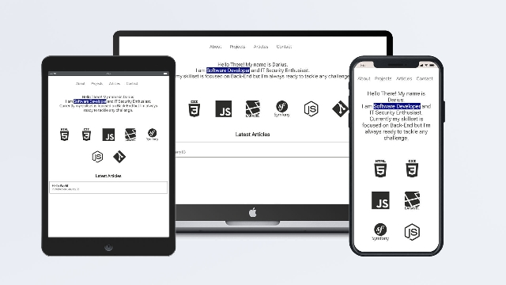

  

  

# Portfolio

Minimalistic portfolio made with Next.js

# Overview

 I needed a website where I could show my projects and write articles about tech. I decided to use Next.js framework, because it allows to build SEO-friendly, static websites and web applications using the React framework.

# What did I use?

<li> Next.js </li>
<li> NextAuth </li>
<li> Prisma </li>
<li> Nodemailer </li>

# How to use

Clone git repository and run (inside root directory):

``npm install``

``npx prisma db push``

``npm run start``